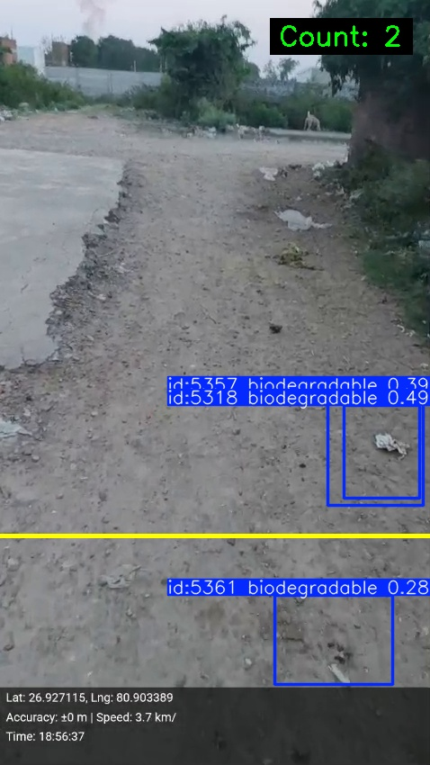

# 🗑️ Garbage Detection & GPS Tracking System

A computer vision pipeline that detects and classifies garbage in video footage using YOLOv8, counts objects crossing a virtual line, estimates distance, and logs GPS coordinates for each detection event.

---

## 📁 Project Structure

```
├── Garbage_Detection_github.ipynb     # Notebook 1: Model training
└── GPS___Dist_Garbage__github.ipynb   # Notebook 2: Inference, GPS & distance
```

---

## 🖼️ Sample Output

Below is a real annotated frame produced by the pipeline:



**What you can see in this frame:**
- **Blue bounding boxes** — detected garbage objects with their tracker ID, class name (`biodegradable`), and confidence score (e.g. `0.49`, `0.39`, `0.28`)
- **Yellow counting line** — the virtual line at 70% of frame height; objects crossing downward are counted
- **Count overlay** (top-right, green text) — running total of objects that have crossed the line (`Count: 2`)
- **GPS & telemetry bar** (bottom) — live metadata stamped on the frame:
  - `Lat: 26.927115, Lng: 80.903389` — camera GPS position
  - `Accuracy: ±0 m | Speed: 3.7 km/h` — GPS accuracy and movement speed
  - `Time: 18:56:37` — timestamp of the frame

---

## 📓 Notebook 1 — `Garbage_Detection_github.ipynb`

### Purpose
Trains a custom YOLOv8 object detection model on a labelled garbage dataset with 5 categories.

### Workflow

**Step 1 — Mount Google Drive**
Mounts your Google Drive inside Colab to access the dataset and save trained weights.

**Step 2 — Locate the Dataset**
Searches Drive for the dataset zip file (`Garbage_My_Dataset.yolov8.zip`) and extracts it to `/content/My_garbage_Detection`.

**Step 3 — Write the YAML Config**
Creates `data.yaml` which tells YOLOv8 where the training/validation images are and defines the 5 object classes:

| Index | Class Name     |
|-------|----------------|
| 0     | biodegradable  |
| 1     | metal          |
| 2     | paper          |
| 3     | plastic        |
| 4     | leaf           |

**Step 4 — Train the Model**
Trains `yolov8s.pt` (small variant) for **50 epochs** at **135×135 px** image size with a batch size of 16.

```python
model = YOLO("yolov8s.pt")
model.train(data="/content/data.yaml", epochs=50, imgsz=135, batch=16)
```

**Step 5 — Evaluate**
Reports validation metrics after training:
- `mAP50` — Mean Average Precision at IoU 0.50
- `mAP50-95` — Mean Average Precision across IoU thresholds 0.50–0.95
- `Precision` — Fraction of correct positive detections
- `Recall` — Fraction of true positives found

**Step 6 — Save Weights**
Copies the best checkpoint (`best.pt`) back to Google Drive as `garbage_Detection.pt` for reuse.

**Step 7 — Run Inference on Video**
Loads the trained model and runs it on a test video, drawing bounding boxes and saving the annotated output to `runs/detect/predict/`.

```python
best_model = YOLO("/content/runs/detect/train-3/weights/best.pt")
results = best_model.predict(source=video_path, conf=0.25, save=True)
```

---

## 📓 Notebook 2 — `GPS___Dist_Garbage__github.ipynb`

### Purpose
Loads the trained model to process a real-world video, count garbage objects crossing a virtual line, estimate the distance to each object, and log GPS coordinates alongside every detection event.

### Workflow

**Cell 1-3 — Setup**
Installs dependencies (`ultralytics`, `opencv-python`, `pandas`), mounts Google Drive, and lists its contents.

**Cell 5 — Configuration**
All key parameters are centralised here — edit this cell to adapt the pipeline to a new camera or location:

| Parameter              | Default Value                  | Description                                      |
|------------------------|-------------------------------|--------------------------------------------------|
| `MODEL_PATH`           | `garbage_Detection.pt`        | Path to trained YOLOv8 weights                   |
| `VIDEO_PATH`           | Video file on Drive           | Input video to process                           |
| `CONF`                 | `0.25`                        | Detection confidence threshold                   |
| `KNOWN_OBJECT_HEIGHT`  | `0.5` m                       | Real-world height of a typical garbage object    |
| `FOCAL_LENGTH`         | `800` px                      | Camera focal length (tune per camera)            |
| `CURRENT_LAT`          | `26.8467`                     | Static GPS latitude of the camera                |
| `CURRENT_LON`          | `80.9462`                     | Static GPS longitude (Lucknow, UP)               |
| `LINE_RATIO`           | `0.70`                        | Vertical position of the counting line (70% down)|

**Cell 6 — Load Model**
Loads the saved YOLOv8 weights from Drive.

**Cell 7 — Open Video**
Opens the video with OpenCV, reads resolution and FPS, and initialises a `VideoWriter` to write the annotated output.

**Cell 8 — Initialise Tracking State**
Resets the counter and tracking data structures before the detection loop begins.

**Cell 9 — Detection Loop (Core Logic)**

This is the heart of the pipeline. For every frame it:

1. Runs **YOLOv8 tracking** (`model.track(..., persist=True)`) to maintain object IDs across frames.
2. Draws a horizontal **counting line** at `LINE_Y = height × LINE_RATIO`.
3. For each tracked object:
   - Computes its **centre Y coordinate** (`cy`).
   - Estimates **distance** using the pinhole camera formula:
     ```
     distance = (KNOWN_OBJECT_HEIGHT × FOCAL_LENGTH) / pixel_height
     ```
   - Detects **line crossing**: if an object moves downward past `LINE_Y` and hasn't been counted yet, it increments the counter and saves a snapshot.
4. Overlays a live **count box** (black background, cyan border, green text) in the top-right corner.
5. Appends a structured **record** per detection containing: `frame_id`, `object_id`, `crossed`, `count`, `timestamp_sec`, `gps_lat`, `gps_lon`, `distance_m`.
6. Writes the annotated frame to the output video.

**Cell 10 & 12 — Re-encode to H.264**
Uses `ffmpeg` to re-encode the OpenCV-written `mp4v` video to `libx264` for smooth playback in Colab and standard video players.

**Cell 11 — Inline Preview**
Displays the output video directly inside the notebook.

**Cell 12 — Save Records**
Exports all detection records to:
- `detections.csv` — tabular format for analysis in Excel/pandas
- `detections.json` — structured format for downstream applications

**Cell 13 — Preview Records**
Loads the CSV and displays summary stats and the first 20 rows.

**Cell 14 — View Crossing Snapshots**
Displays the first saved crossing-event image using Matplotlib.

**Cell 15 — Download Outputs**
Downloads everything to your local machine:
- Annotated video (`output_video.mp4`)
- Detection records (`detections.csv`, `detections.json`)
- Crossing frame snapshots (`crossed_frames.zip`)

---

## 📊 Output Files

| File                    | Format  | Contents                                                   |
|-------------------------|---------|------------------------------------------------------------|
| `output_video.mp4`      | Video   | Annotated video with bounding boxes, count overlay, line   |
| `detections.csv`        | CSV     | Per-detection records with GPS, distance, timestamp        |
| `detections.json`       | JSON    | Same records in JSON format                                |
| `crossed_frames/`       | Images  | JPEG snapshots saved at each line-crossing event           |
| `garbage_Detection.pt`  | Weights | Trained YOLOv8 model saved to Google Drive                 |

### CSV / JSON Schema

```
frame_id       — Frame number (0-indexed)
object_id      — YOLO tracker ID for the object
crossed        — True only on the frame the object crosses the line
count          — Cumulative crossing count at that frame
timestamp_sec  — Video timestamp in seconds
gps_lat        — Latitude of the camera location
gps_lon        — Longitude of the camera location
distance_m     — Estimated distance to the object in metres
```

---

## ⚙️ Requirements

| Library       | Purpose                                   |
|---------------|-------------------------------------------|
| `ultralytics` | YOLOv8 model training and inference       |
| `opencv-python` | Video I/O and frame annotation          |
| `pandas`      | Record storage and CSV export             |
| `matplotlib`  | Snapshot preview in notebook              |
| `Pillow`      | Image loading for snapshot display        |
| `ffmpeg`      | Re-encoding output video to H.264         |

Install all at once:
```bash
pip install ultralytics opencv-python pandas matplotlib Pillow
```

> **Note:** These notebooks are designed to run on **Google Colab** with Google Drive mounted. Local execution requires adjusting all file paths.

---

## 🚀 Quick Start

### Train the Model (Notebook 1)
1. Upload your labelled dataset zip to Google Drive.
2. Open `Garbage_Detection_github.ipynb` in Colab.
3. Run all cells in order.
4. The best weights are saved as `garbage_Detection.pt` on your Drive.

### Run Inference with GPS & Distance (Notebook 2)
1. Upload your input video to Google Drive.
2. Open `GPS___Dist_Garbage__github.ipynb` in Colab.
3. Edit **Cell 5** to set the correct model path, video path, GPS coordinates, and camera focal length.
4. Run all cells in order.
5. Use **Cell 15** to download all outputs.

---

## 🔧 Tuning Tips

**Detection not finding objects?**
Lower the confidence threshold in Cell 5: `CONF = 0.15`

**Count seems wrong?**
Adjust `LINE_RATIO` — `0.5` places the line at the middle of the frame, `0.7` at 70% from the top.

**Distance readings inaccurate?**
Measure your camera's actual focal length in pixels and set `FOCAL_LENGTH` accordingly. Also update `KNOWN_OBJECT_HEIGHT` to match the typical real-world height of the garbage in your scene.

**Wrong GPS location?**
Update `CURRENT_LAT` and `CURRENT_LON` in Cell 5 to match where your camera is deployed.

---

## 📌 Notes

- The GPS coordinates are **static** — they represent the fixed location of the camera, not a moving device. For a mobile setup, GPS data would need to be streamed in per frame.
- The distance estimation uses a **pinhole camera model** and assumes the object's bottom edge is at a known real-world height. Accuracy depends on calibrating `FOCAL_LENGTH` for your specific camera.
- Object counting is **unidirectional** — only downward crossings through the line are counted to avoid double counting.
